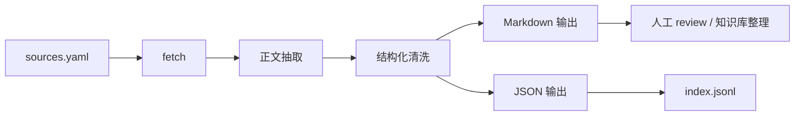

# 力量举动作技术知识库爬虫设计方案

## 1. 目标

在 `model/knowledge_crawler/` 下建立一个独立爬虫项目，用来持续补充力量举动作技术知识库，为后续：

- 筛查手册扩充
- LLM 分析提示词增强
- taxonomy 细化
- cue / drill 推荐稳定化

提供更系统的原始资料。

这个项目的定位不是“通用大爬虫”，而是：

- 面向力量举 / 力量训练垂类
- 更关注内容质量和结构化清洗
- 为知识库建设服务

## 2. 核心产出

每条抓取内容最终要转成两类资产：

1. 清洗后的 Markdown
- 适合人工 review
- 适合后续整理到手册、专题文档、RAG 素材

2. 结构化 JSON / index
- 保留来源、动作类型、标签、标题、摘要
- 方便后续去重、筛选、聚合

## 3. 项目结构

```text
model/
  knowledge_crawler/
    crawler/
      cli.py
      config.py
      fetch.py
      parse.py
      pipeline.py
      store.py
    seeds/
      sources.example.yaml
    requirements.txt
    README.md
```

## 4. 抓取范围建议

第一阶段不要做“大而全”，建议只抓这几类来源：

- 力量举教练文章
- 技术拆解博客
- 知名训练机构的动作指南
- 论坛中高质量长帖
- 视频页面的文字说明页

不建议第一阶段就做：

- 全站递归爬取
- 社交媒体动态流
- 纯视频音频自动转写
- 低质量 UGC 海量抓取

## 5. 采集粒度

建议按“单篇内容”采集，而不是一上来做站点级大规模深爬。

理由：

- 更容易人工控制来源质量
- 更容易做动作标签标注
- 更适合先做知识库建设，而不是先做搜索引擎

第一阶段以 `sources.yaml` 驱动：

- 每条来源一个 URL
- 明确 `lift`
- 明确 `source_type`
- 明确 `tags`

补充说明：

- 对于 bilibili 作者主页 / 上传页这类“列表型来源”，应把它们当成“来源入口”
- 当前项目现在已经支持：
  - 从频道页发现一批视频链接
  - 进入单个视频页
  - 尝试抓取字幕 / ASR
- 所以 bilibili 在这个知识库里承担的是：
  - 来源入口层
  - 作者池
  - 视频知识素材发现层

## 6. 数据流



## 7. 清洗策略

### 7.1 保留内容
- 标题
- 正文
- 小标题层级
- 关键动作 cue
- 常见错误描述
- 纠正策略
- drill 建议

### 7.2 删除内容
- 广告
- 导航
- 评论区
- 推荐阅读
- 过多版权/页脚信息

### 7.3 后续增强
后续可以增加规则，把正文进一步切成：

- `problem_patterns`
- `coaching_cues`
- `drills`
- `setup`
- `common_mistakes`

## 8. 如何接到现有知识库链路

当前项目里已经有：

- [model/力量举技术筛查手册.md](/Users/liumiao/Documents/trae_projects/model/力量举技术筛查手册.md)
- [model/力量举技术筛查手册_v2_app版.md](/Users/liumiao/Documents/trae_projects/model/力量举技术筛查手册_v2_app版.md)

建议后续流程：

1. 先用爬虫抓出原始资料
2. 人工筛选高质量内容
3. 按动作类型整理成专题 Markdown
4. 再并入：
   - 筛查手册补充章节
   - taxonomy 说明文档
   - LLM prompt 的知识片段

也就是说，爬虫输出的是“原料层”，不是直接替换手册。

## 9. 建议的数据标准

每条内容建议最少带这些字段：

```json
{
  "name": "deadlift-setup-demo",
  "url": "https://example.com/deadlift-setup",
  "sourceType": "article",
  "lift": "deadlift",
  "tags": ["deadlift", "setup", "technique"],
  "title": "How to Set Up for the Deadlift",
  "excerpt": "…",
  "headings": ["Setup", "Bracing", "Common Errors"],
  "markdown": "..."
}
```

## 10. 第二阶段建议

当前骨架跑通后，再做这些增强：

### 10.1 去重
- URL 去重
- 标题近似去重
- 正文 hash 去重

### 10.2 质量评分
- 是否为长文
- 是否有清晰分段
- 是否包含动作错误与纠正建议
- 是否为高价值技术内容

### 10.3 自动标签增强
- 自动识别：
  - squat / bench / deadlift
  - setup / bracing / bar path / stance / cue / drill

### 10.4 知识切片
- 按段落切 chunk
- 为后续 RAG / embeddings 做准备

### 10.5 视频站点来源扩展
- 增加 bilibili/YouTube 这类频道页的列表发现器
- 从频道页提取视频链接、标题、简介、发布时间、标签
- 只把“技术讲解 / 错误分析 / cue / drill”类视频送入知识库候选池
- 对单视频页尽量抓：
  - 简介
  - 自动字幕 / 上传字幕
  - 关键元信息

## 11. 第三阶段建议

如果后面你想把知识库做成真正可维护的系统，可以继续扩：

- 列表页发现器
- 来源白名单 / 黑名单
- 站点级抓取策略
- 自动摘要
- embedding 建库
- 知识冲突标记
- 人工审核后台

## 12. 当前建议的落地顺序

### 第一步
- 用当前骨架抓 10 到 20 篇高质量文章
- 验证清洗结果是否可读

### 第二步
- 补去重和质量评分

### 第三步
- 补知识切片与 taxonomy 对齐

### 第四步
- 再考虑更大规模抓取

## 13. 和主项目的边界

这个爬虫项目当前不应该：

- 直接耦合到 FastAPI 主服务
- 直接在线抓取并给线上分析调用
- 把未经审核的内容直接塞给最终用户

更合理的边界是：

- 它是一个离线知识构建工具
- 输出给：
  - 手册维护
  - taxonomy 扩展
  - LLM 提示词知识片段

## 14. 下一步建议

这个项目骨架已经可以作为起点。下一步最值得做的是：

1. 先补一份真实 `sources.yaml`
2. 选一批高质量力量举来源
3. 跑第一轮抓取
4. 根据输出质量决定要不要继续加：
  - 去重
  - 质量评分
  - chunking

当前你给的这两个 bilibili 作者，已经适合作为第一批真实来源放进 `sources.yaml`，后续建议优先补“频道页 -> 单视频详情页”的发现能力。
