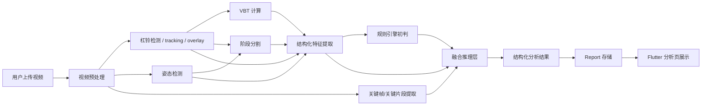

# 力量举技术分析实现方案 v1

## 1. 文档目的
- 把“力量举技术分析方案”整理成适合当前项目落地的工程实现方案
- 让方案直接兼容当前代码库，而不是另起一套新系统
- 作为后续开发前的 review 文档，先确认架构、边界、分期和接口

## 2. 当前项目基线

### 2.1 已有能力
- Flutter 前端已完成视频导入、上传、分析轮询、结果展示
- FastAPI 后端已完成：
  - 视频上传与任务队列
  - 杠铃轨迹检测
  - overlay 生成
  - VBT 计算
  - report 持久化
- 当前主链路已经是：
  - 选视频
  - 上传
  - 创建分析任务
  - 异步处理
  - 拉取 report
  - 前端显示轨迹/VBT

### 2.2 当前缺口
- 还没有人体姿态检测
- 还没有动作阶段分割
- 还没有结构化动作特征提取
- 还没有“问题判断 + 证据 + 建议”的稳定结构化输出
- 还没有历史对比和个性化建议

## 3. 产品目标
- 面向深蹲、卧推、硬拉的视频技术分析
- 输出不只是“杠铃速度”，而是：
  - 技术问题
  - 证据
  - 可信度
  - cue
  - drill
  - 训练调整建议
- 结果既要能给用户看，也要能被系统继续消费用于历史对比和计划调整

## 4. 核心设计原则

### 4.1 双通道架构
不要只靠视频，也不要只靠关键点/轨迹。

采用双通道：
- 通道 A：原始视频 / 关键帧 / 关键片段
- 通道 B：结构化运动学特征

最终由融合层统一输出结果。

### 4.2 杠铃轨迹优先于姿态检测
- 在力量举场景中，杠铃轨迹通常比人体关键点更稳定
- 姿态检测只作为证据层，不作为唯一真相
- 对低质量帧要允许插值、降权或放弃结论

### 4.3 LLM 负责解释，不负责测量
- CV / 规则模块负责：
  - 杠铃检测
  - 姿态检测
  - 阶段分割
  - 数值特征提取
- 融合 / LLM 模块负责：
  - 多证据融合
  - 问题归因
  - 文案生成
  - 结构化 JSON 输出

### 4.4 输出必须结构化
- 前端展示依赖稳定字段
- 历史趋势依赖稳定字段
- 后续训练处方依赖稳定字段
- 所以输出不能只有自然语言

## 5. 总体架构



## 6. 分层实现方案

### 6.1 第 1 层：视频预处理层
职责：
- 标准化输入视频
- 给后续 CV 和融合层提供统一输入

输入：
- 原始上传视频

输出：
- 标准化视频元数据
- 关键帧
- 关键片段
- 视频质量信息

建议处理项：
- 统一帧率为 30fps
- 保留原始分辨率或压到检测可接受的尺寸
- 自动抽取关键帧
- 生成 preview 用缩略图
- 计算质量指标：
  - 亮度
  - 模糊度
  - 是否全身入镜
  - 是否能看到完整杠铃

建议新增文件：
- [server/video/preprocess.py](/Users/liumiao/Documents/trae_projects/server/video/preprocess.py)
- [server/video/quality.py](/Users/liumiao/Documents/trae_projects/server/video/quality.py)

### 6.2 第 2 层：CV / 运动学层

#### 6.2.1 杠铃子模块
沿用现有实现，继续作为第一优先级证据源。

现有文件：
- [server/barbell/trajectory.py](/Users/liumiao/Documents/trae_projects/server/barbell/trajectory.py)
- [server/barbell/tracking.py](/Users/liumiao/Documents/trae_projects/server/barbell/tracking.py)
- [server/barbell/overlay.py](/Users/liumiao/Documents/trae_projects/server/barbell/overlay.py)
- [server/barbell/vbt.py](/Users/liumiao/Documents/trae_projects/server/barbell/vbt.py)

继续产出：
- canonical overlay
- VBT
- 杠铃时序轨迹
- scale/source/debug 元数据

#### 6.2.2 姿态子模块
职责：
- 检测 2D 关键点
- 提供角度、对称性、相对位置等辅助证据

建议模型路线：
- MVP：MediaPipe Pose 或单人 2D pose
- 长期：RTMPose top-down 单人姿态

不建议：
- 一开始做多人 bottom-up
- 一开始上 whole-body 全关键点

MVP 关键点集：
- 髋、膝、踝
- 肩、肘、腕
- 头、躯干中点

建议新增文件：
- [server/pose/pose.py](/Users/liumiao/Documents/trae_projects/server/pose/pose.py)
- [server/pose/overlay.py](/Users/liumiao/Documents/trae_projects/server/pose/overlay.py)

#### 6.2.3 阶段分割子模块
职责：
- 把动作切成可解释的阶段

MVP 先用规则，不上单独模型。

按项目定义：
- squat
  - descent
  - bottom
  - ascent
  - lockout
- bench
  - descent
  - chest_touch
  - press
  - lockout
- deadlift
  - slack_pull
  - floor_break
  - knee_pass
  - lockout
  - descent

信号来源：
- 杠铃 y 轨迹
- 杠铃速度变化
- 关键点角度变化
- 关键事件阈值

建议新增文件：
- [server/analysis/phases.py](/Users/liumiao/Documents/trae_projects/server/analysis/phases.py)

#### 6.2.4 特征提取子模块
职责：
- 从轨迹、姿态、阶段中提取结构化特征

建议按 lift 分层：

深蹲重点特征：
- 杠铃是否在中足附近
- 髋膝同步性
- 底部骨盆后卷趋势
- 躯干前倾变化
- 左右骨盆偏移
- 向心阶段 sticking point

卧推重点特征：
- 下放路径与上推路径
- 触胸点稳定性
- 前臂是否接近垂直
- 手腕背伸
- 左右锁定同步性
- 臀部离凳检测

硬拉重点特征：
- 起杠瞬间肩髋杠相对位置
- 杠离身程度
- 杠路径贴身程度
- 背部曲度变化
- 锁定是否后仰代偿
- 起杠发力顺序

建议新增文件：
- [server/analysis/features.py](/Users/liumiao/Documents/trae_projects/server/analysis/features.py)
- [server/analysis/rules.py](/Users/liumiao/Documents/trae_projects/server/analysis/rules.py)

### 6.3 第 3 层：融合推理层
职责：
- 统一融合视频证据和结构化证据
- 输出稳定 JSON
- 生成可解释结论

输入分三类：
- 关键帧 / 关键片段
- 结构化特征 JSON
- 规则引擎初判标签

输出目标：
- 最多 3 个主要问题
- 每个问题必须有：
  - 视觉证据
  - 数值证据
  - 置信度
- 给 1 个最优先 cue
- 给 1 到 2 个 drills
- 给 1 条负荷调整建议

融合策略建议：

第一阶段：
- 不接 LLM
- 仅规则融合
- 保证结构稳定和证据链闭环

第二阶段：
- 引入 LLM
- 让 LLM 做：
  - 问题归因
  - 文案解释
  - 建议组织
- 但不让 LLM 改写底层数值

建议新增文件：
- [server/fusion/schema.py](/Users/liumiao/Documents/trae_projects/server/fusion/schema.py)
- [server/fusion/rules.py](/Users/liumiao/Documents/trae_projects/server/fusion/rules.py)
- [server/fusion/llm.py](/Users/liumiao/Documents/trae_projects/server/fusion/llm.py)

## 7. Report Schema 扩展方案

建议继续使用现有 report 的 `meta_json`，不要额外新开一套结果存储。

目标结构：

```json
{
  "durationMs": 12700,
  "barbell": {},
  "overlay": {},
  "vbt": {},
  "pose": {
    "quality": {
      "usable": true,
      "confidence": 0.82
    },
    "keypoints": [],
    "overlay": {}
  },
  "phases": [
    {
      "name": "ascent",
      "startMs": 10233,
      "endMs": 11433
    }
  ],
  "features": {
    "barPathDriftCm": 2.8,
    "torsoLeanDeltaDeg": 10.5,
    "hipKneeSyncScore": 0.74,
    "symmetryScore": 0.81,
    "stickingRegion": {
      "startMs": 10600,
      "endMs": 10980
    }
  },
  "analysis": {
    "liftType": "squat",
    "confidence": 0.78,
    "issues": [
      {
        "name": "hip_shoot",
        "severity": "high",
        "confidence": 0.84,
        "visualEvidence": [
          "起立初段躯干角度快速增大"
        ],
        "kinematicEvidence": [
          "髋上升早于杠铃加速 120ms"
        ],
        "timeRangeMs": {
          "start": 10320,
          "end": 10820
        }
      }
    ],
    "cue": "先把背顶住杠，再带髋一起上升",
    "drills": [
      "pause squat",
      "tempo squat"
    ],
    "loadAdjustment": "next_set_minus_5_percent",
    "cameraQualityWarning": null
  }
}
```

## 8. 后端任务流水线改造

### 8.1 当前流水线
- upload
- finalize
- set create
- analysis job create
- worker 处理 barbell / vbt / report

### 8.2 目标流水线
- upload
- finalize
- set create
- analysis job create
- worker 依次执行：
  - preprocess
  - barbell_detect
  - pose_detect
  - phase_segment
  - feature_extract
  - fusion_generate
  - report_write

### 8.3 Job 状态建议
建议把当前进度文案结构化，和前端 loading 卡片对齐：
- `uploaded`
- `queued`
- `preprocessing`
- `barbell_detecting`
- `pose_detecting`
- `segmenting`
- `extracting_features`
- `generating_analysis`
- `completed`
- `failed`

## 9. 前端展示方案

### 9.1 当前前端能力
现有 VBT 分析页已支持：
- 视频播放
- 杠铃轨迹 overlay
- HUD
- 异步分析进度
- rep 结果展示雏形

### 9.2 建议新增展示块
- 视频区：
  - 杠铃轨迹 overlay
  - 可选姿态 overlay
  - phase 高亮
- 指标区：
  - VBT
  - rep 列表
  - confidence badge
- 问题区：
  - Top 3 问题卡
  - 每个卡片带时间证据
- 建议区：
  - cue
  - drill
  - load adjustment

### 9.3 前端代码建议
当前 [app/lib/main.dart](/Users/liumiao/Documents/trae_projects/app/lib/main.dart) 已经承载过多分析页逻辑，建议尽快拆分：
- [app/lib/screens/video_analysis_screen.dart](/Users/liumiao/Documents/trae_projects/app/lib/screens/video_analysis_screen.dart)
- [app/lib/widgets/barbell_overlay.dart](/Users/liumiao/Documents/trae_projects/app/lib/widgets/barbell_overlay.dart)
- [app/lib/widgets/pose_overlay.dart](/Users/liumiao/Documents/trae_projects/app/lib/widgets/pose_overlay.dart)
- [app/lib/widgets/finding_card.dart](/Users/liumiao/Documents/trae_projects/app/lib/widgets/finding_card.dart)
- [app/lib/widgets/phase_timeline.dart](/Users/liumiao/Documents/trae_projects/app/lib/widgets/phase_timeline.dart)

## 10. 分期计划

### Phase 1：结构化分析 MVP
目标：
- 不做过度智能化
- 先把“证据层”做稳定

范围：
- 杠铃轨迹与 VBT 继续保留
- 加基础姿态检测
- 加阶段分割
- 加规则特征
- 输出结构化 analysis JSON
- 前端显示 Top 3 问题卡和 phase 时间轴

不做：
- 个性化计划
- LLM 自由生成
- 历史长期趋势

验收标准：
- 一条视频能稳定产出：
  - overlay
  - vbt
  - phases
  - features
  - 1 到 3 个问题标签

### Phase 2：融合解释层
目标：
- 让结果更像教练反馈，而不是原始指标堆砌

范围：
- 增加关键帧抽取
- 增加视觉 + 特征融合
- 引入 LLM 做解释和建议
- 所有输出走 schema 约束

验收标准：
- 每个问题都带视觉证据和数值证据
- 文案解释稳定
- 不出现无证据高置信度结论

### Phase 3：历史趋势和个性化
目标：
- 从单次分析走向训练闭环

范围：
- 同一用户历史对比
- 常见问题追踪
- 自动生成下一次训练建议
- 结合重量 / RPE / 成功率输出负荷调整

## 11. 风险与控制

### 11.1 拍摄质量不稳定
风险：
- 角度乱
- 逆光
- 遮挡
- 杠铃/全身不完整

控制：
- 前端提供拍摄示例
- 上传后先跑质量检查
- report 中输出 `cameraQualityWarning`
- 低质量时降级结果，不强行下结论

### 11.2 过度依赖姿态检测
风险：
- 2D pose 在力量举场景容易漂

控制：
- 姿态只作为辅助证据
- 杠铃轨迹优先级更高
- 对低置信关键点降权

### 11.3 一开始就做太重的 LLM 链路
风险：
- 成本高
- 不稳定
- 难调试

控制：
- 第一阶段先规则输出
- 第二阶段再接融合解释

### 11.4 前端继续堆在 main.dart
风险：
- 页面逻辑继续膨胀
- 后续 overlay / findings / phase 都难维护

控制：
- 在 Phase 1 同步拆页面和 widget

## 12. 我建议先拍板的几个决策
- Phase 1 是否先完全不接 LLM，只做规则输出
- 姿态检测 MVP 用 MediaPipe 还是直接 RTMPose
- 是否把视频质量检查作为正式分析前置条件
- analysis 结果是否坚持“最多 3 个问题”

## 13. 推荐结论
- 技术路线采用：
  - 视频视觉证据 + 结构化运动学特征的双通道方案
- 实现顺序采用：
  - 先证据层
  - 再融合解释
  - 最后做历史与计划闭环
- 当前代码库最优落地方式：
  - 继续复用现有 report / analysis job / overlay / VBT 链路
  - 在服务端补 pose / phases / features / fusion 四个模块
  - 在前端拆出独立的视频分析页和证据组件

如果这个版本方向确认，下一步建议直接再出一份：
- 模块拆分清单
- API 字段清单
- Phase 1 的任务拆解 backlog
